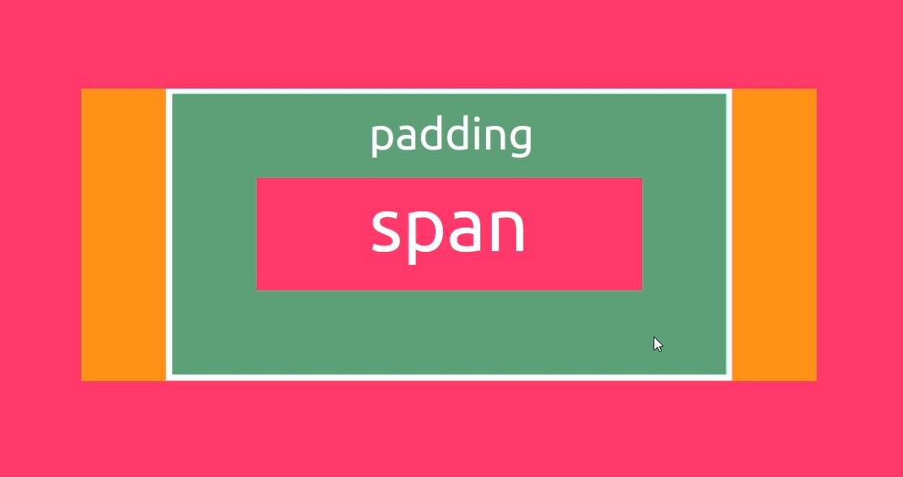

# CSS

- **style sheet**: a list of CSS rules / rule sets

### text-decoration:
* underline (altı çizili)
* line-through (üstü çizili)
* none

----------------
## Codes until minute 29:
### index.html
```html
<!DOCTYPE html>

<html>

<head>
    <link rel="stylesheet" href="styles.css">
    <title>CSS Basics</title>
</head>

<body>
    <h1>CSS Basics</h1>

    <p>Lorem ipsum dolor sit amet consectetur, adipisicing elit. Id neque, aperiam sit ipsa sapiente nostrum, recusandae
        amet accusantium, quod vitae quisquam odit quae dolores in cupiditate nihil. Quasi reprehenderit amet autem
        laudantium, assumenda ullam numquam! Exercitationem itaque est molestiae totam!</p>

    <div>
        <h2>Ninjas available for hire</h2>
        <p>Lorem ipsum dolor sit amet consectetur adipisicing elit. Rerum, commodi ratione sequi voluptas ab nulla
            dolorem labore aut. Necessitatibus alias aspernatur dolor nobis fugit similique a obcaecati adipisci.
            Reiciendis tempore voluptatum delectus iusto ut ipsam temporibus? Facere ex voluptas, earum aliquam enim
            provident nam libero exercitationem culpa. Omnis, sapiente quisquam!</p>
        <ul>
            <li>Ninja Yoshi</li>
            <li>Ninja Mario</li>
            <li>Ninja Shaun</li>
        </ul>
    </div>
</body>

</html>
```
### styles.css
```css
h1 {
  color: orange;
  background-color: slategray;
  font-size: 20px;
  text-decoration: underline;
  font-family: arial; /* font seçimi */
  text-align: center;
}

p {
  color: slategray;
  text-align: right;
  line-height: 30px; /* Line space, satır arası uzunluğu */
  letter-spacing: 2px; /* Harf arası uzunluk */
  column-count: 2; /* Sütun sayısı, gazete yazılarındaki gibi */
  column-gap: 60px; /* Sütunlar arası boşluk uzunluğu */
}

ul {
  /* border-width: 4px; /* border genişliği *\/ 
    border-style: solid;
    border-color: crimson; */
  /* border: 4px solid crimson; */
  border-bottom: 4px dotted rgba(29, 29, 25, 0.459);
  border-left: 8px dashed crimson;
}

li {
  list-style-type: none; /* li taglerindeki yuvarlak işaretçiyi gösteriyor, varsayılan `disc` */
  /*text-shadow: 2px 2px lightgray;*/ /* horizontal (sağdan) 2px, vertical (aşağıdan) 2 px offset ile gölge */
  text-shadow: 2px 2px #e9e9e9
}
```
----------------
## Block-Inline

### inline elements: 
* span, img, strong, em, a and more...
### block-level elements: 
* p, div, h1, h2, h3, ul, li and more...

Bir elementin `block` veya `inline` olması CSS üzerinden kontrol edilir. CSS ile `block` elementin `inline` gibi, `inline` elementin ise `block` gibi davranmasını sağlayabiliriz.

```css
span {
  display: block;
}

h1, h2, h3, h4, h5, h6 {
  display: inline;
}
```
Eğer elementi `inline-block` yaparsak yine inline olurken, _margin_ ve _padding_ onun block kısmını oluşturur.
```css
span {
  display: inline-block;
  margin: 20px;
  padding: 20px;
}
```

--------------------
## Margin & Padding





**Margin Collapse:** Alt alta 2 marginden en fazla olanını margin olarak ayarlıyor ve toplamıyor. Eğer alt alta 2 divin de 20 lik margini olursa aralarındaki margin 40 değil 20 olur. Eğer biri 60 biri 20 olursa aralarındaki margin 60 olur.

------------------
## Classes & Selectors

`error` adında class oluşturduk. Bu classa sahip olan elementler ilgili style'a sahip olacaklar.
```css
.error {
  color: red;
}
```

Eğer biz `error` classına sahip olan hangi elementin bu style'a sahip olacağını belirlemek istiyorsak aşağıdakini yapıyoruz:
```css
p.error {
  color: red;
}
```
Bu sayede `error` class'ına sahip `p` elementi ilgili style'a sahip olacak.

**NOT**: Arada `boşluk` olmamasına dikkat edin.

Aşağıdaki kod ile `success` ve `feedback` classlarına sahip `p` elementlerini style etmiş oluyoruz.
```css
p.success.feedback {
  border: 1px dashed rgb(5, 43, 28);
}
```
`content` id'sine sahip `div` elementlerini style etmek için:
```css
div#content {
  background-color: #ebebeb;
  padding: 20px;
}
```
---
`div` elementi parent `p` elementi child olanları style etmek için:
```css
div p {
  color: purple;
}
```
`div` elementinin altındaki `p` elementinin altındaki `a` elementlerini style etmek için:
```css
div p a {
  color: purple;
}
```
`div` elementinin altındaki `error` class'ına sahip olan elementleri style etmek için:
```css
div .error {
  color: red;
}
```
---
## Attribute Selectors

`href` attribute'una sahip her `a` tagini style etmek için:
```css
a[href] {
  background-color: #3dd13d;
}
```

`href` attribute'u *https://www.thenetninja.co.uk* olan her a elementini style etmek için:
```css
a[href="https://www.thenetninja.co.uk"] {
  background-color: #3dd13d;
}
```

`href` attribute'u *thenetninja* **içeren** her a elementini style etmek için:
```css
a[href*="thenetninja"] {
  background-color: #3dd13d;
}
```

`href` attribute'u *.com* **ile biten** her a elementini style etmek için:
```css
a[href$=".com"] {
  background-color: #3dd13d;
}
```
---
## Cascade
Kelimelerin yukarıdan aşağıya sıralanması gibi bir kelime manası var.
Asıl olarak, `child` elementlerin `parent` elementlerden inheritance yaptığını belirtmektedir.

```html
<div>
  <p>hello</p>, <span>ninjas</span>
</div>
```
Yukarıdaki kodda `p` ve `span` elementleri de `div` tagini (aşağıda) style ettiğimizden kaynaklı style edilmiş olacaklar.
```css
div {
  color: red;
}
```
**NOT**: Margin, padding, background styles ve border gibi şeyler inherit edilmezler. Ana olarak fontlar, textler, colorlar inherit edilir.

Inherit edilmeyen şeyleri inherit etmek için `inherit` word'unu kullanıyoruz:
```css
p {
  border: inherit;
  margin: inherit;
}
```
---
## Semantic Tags

- \<main>: For the content of a webpage, unique to that page
- \<section>: Defines a certain section of a webpage (e.g. blog list, contact info)

- \<article>: Defines a bit of content which makes up an article (e.g. a blog bost)

- \<aside>: Defines some content related to something else (e.g. similar blogs)

- \<header>: For the header of a website - contains the nav, title etc.

- \<footer>: For the footer of a website

---
## Position & Layout

### Position

- Static: The default value
- Relative: 
- Fixed: That positions a certain element relative to the viewport and now the viewport is just a part of a browser that we see the webpage on

Sayfayı aşağı kaydırsak bile aynı yerinde sabit olarak kalır:

- Absolute: Allows us to position things absolutely relative to its closest parent which has also been given a position property that is not static

- Sticky: A mixture of `static` and `fixed`.

When we position something `absolutely` we take it out of normal document flow and we lose that space it was originally in.

`Absolute` position'ı `parent'ına göre` hizalanıyormuş gibi düşünebiliriz.

`Sticky` sayfada görüş açımızda olduğu müddetçe aynı yerinde kalır. Ancak görüş açımızdan çıkacağı zaman `fixed` gibi davranır. WhatsApp'ta gördüğüm yapıya benziyor.

This is a nice way to centralize things:
```css
nav ul {
  white-space: nowrap; /* Sonraki satıra inmemesi için */
  max-width: 1200px; /* Kaplayabileceği en fazla genişlik */
  margin: 0 auto; /* Top-Bottom 0, Left ve Right'tan otomatik olarak taşan kısmı margin ile doldursun dedik */
}
```

### CSS Codes In Video #8:

```css
body, ul, li, h1, h2, a {
  margin: 0;
  padding: 0;
  font-family: arial;
}

header {
  background-color: #f63232;
  padding: 20px;
  text-align: center;
  position: fixed;
  width: 100%;
  z-index: 1;
  top: 0;
  left: 0;
}

header h1 {
  color: white;
  border: 8px solid white;
  padding: 6px 12px;
  display: inline-block;
  border-radius: 36px;
}

.banner {
  position: relative;
}

.banner img {
  max-width: 100%; /* Tam ekranımızı kaplıyor */
}

.banner .welcome {
  background-color: #feb614;
  color: white;
  padding: 30px;
  position: absolute;
  left: 0;
  top: 30%;
}

.banner h2 {
  font-size: 74px;
}

.banner h2 span {
  font-size: 1.3em;
}

nav {
  background-color: #f4f4f4;
  padding: 20px;
  position: sticky;
  top: 105px; /* When it gets to 100px from the top it's going to stick there*/
}

nav ul {
  white-space: nowrap; /* Sonraki satıra inmemesi için */
  max-width: 1200px;
  margin: 0 auto;
}

nav li {
  width: 25%;
  display: inline-block; /* So they sit next to each other. */
  font-size: 24px;
}

nav li a {
  text-decoration: none;
  color: #4b4b4b;
}

nav li a.join {
  color: #f63232;
}

main {
  max-width: 100%;
  width: 1200px; /* Eğer 1200px'den fazla çözünürlük varsa, 1200 e tamamlancak eğer 1200px den az ise tüm genişliği kaplayacak*/
  margin: 80px auto;
  padding: 0 40px; /* Bunu yapınca, max-width i 100% yapsak bile sağa doğru taşma oluyor ondan kurtulmak için aşağıdaki satırı yapıyoruz*/
  box-sizing: border-box; /* What that does is say okay I want you to incorporate this padding into the total width.*/
}

article h2 {
  color: #f63232;
  font-size: 48px;
}

article p {
  line-height: 2em;
  color: #4b4b4b;
}

.images {
  text-align: center;
  margin: 80px 0;
  white-space: nowrap;
}

.images li {
  display: inline-block; /* Bu şekilde yan yana olmalarını sağlıyoruz */
  width: 40%;
  margin: 20px 5%;
}

.images li img {
  max-width: 100%; /* which is 100% of its parent container so 40% */
}

section.join {
  background-color: #f4f4f4;
  text-align: center;
  padding: 60px 20px;
  color: #4b4b4b;
}

.join h2 {
  font-size: 36px;
}

form input[type="email"] {
  margin: 20px 0;
  padding: 10px 20px;
  font-size: 24px;
  border-radius: 28px;
  border: 4px solid white;
  text-align: center;
}

footer {
  background-color: #f63232;
  color: white;
  padding: 10px;
  text-align: center;
}

```

## Pseudo Classes & Elements

### Pseudo Classes

Style elements when they're in a particular state
- hover, focus, first child of a parent

Reference: https://www.w3schools.com/css/css_pseudo_classes.asp

```css
/* pseudo classes */

nav li a:hover {
  text-decoration: underline;
}

.images li:hover {
  position: relative;
  top: -4px;
  cursor: pointer;
}

form input:focus {
  border: 4px dashed #4b4b4b;
  outline: none;
}

form input:valid {
  border: 4px solid #71d300;
}

/* nav li:first-child {
  border: 3px solid #f63232;
} */

/* pseudo elements */

article p::first-line { /* her p elementinin ilk satırı */
  font-weight: bold;
  font-size: 1.2em;
}

section.join p::first-letter { /* her p elementinin ilk harfi */
  font-size: 1.5em;
}

p::selection { /* seçtiğimiz kısmı style etmek için */
  background-color: #f63232;
  color: white;
}

p::after {
  content: "..."; /* her "p" taginden sonra "..." ekliyoruz*/
}

a::before {
  content: "tttt"; /* her "a" taginden önce "tttt" ekliyoruz*/
}
```
---
## Responsive Design

### Media Queries:
Tell the browser how to style an element at particular viewport dimensions

### Viewport meta tag:
Tells the browser what width the viewport should be

### Responsive images:
Only load smaller images for mobile devices

<br>
Mobile-first approach: Sitenin öncelikle mobil uyumlu yapılıp sonradan masaüstüne göre yapılması yaklaşımı

Viewport Reference: https://www.w3schools.com/css/css_rwd_viewport.asp

```css
/* responsive styles */

@media screen and (max-width: 1400px) {
  .banner .welcome h2 {
    font-size: 60px;
  }

  nav li {
    font-size: 18px;
  }
}

@media screen and (max-width: 960px) {
  .banner .welcome h2 {
    font-size: 60px;
  }
}

@media screen and (max-width: 700px) {
  .banner .welcome {
    position: relative;
    text-align: center;
    padding: 10px;
  }

  .banner .welcome br {
    display: none;
  }

  .banner .welcome h2 {
    font-size: 25px;
  }

  .banner .welcome span {
    font-size: 1em;
  }

  .images li {
    width: 100%;
    margin: 20px auto;
    display: block;
  }
}

@media screen and (max-width: 560px) {
  nav li {
    font-size: 20px;
    display: block;
    width: 100%;
    margin: 12px 0;
  }

  header {
    position: relative;
  }

  nav {
    top: 0;
  }
}
```